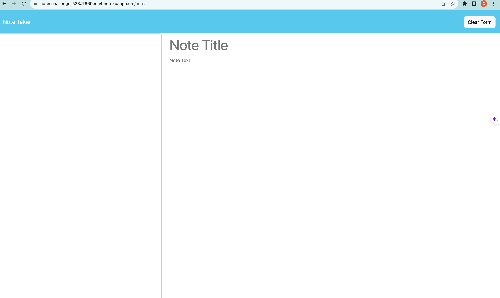

# Note Taker

An application that allows users to write, save, and delete notes. This application uses an Express.js backend and saves and retrieves note data from a JSON file.

 

## Table of Contents

- [Installation](#installation)
- [Usage](#usage)
- [License](#license)
- [Contributing](#contributing)
- [Tests](#tests)
- [Questions](#questions)

## Installation

1. Clone the repository to your local machine.
2. Navigate to the root directory of the project in your terminal and run `npm install` to install the necessary dependencies.

## Usage

1. Navigate to the root directory of the project in your terminal.
2. Run `npm start` to start the server.
3. Open your browser and visit https://noteschallenge-523a7669ecc4.herokuapp.com/ to access the application.

## License

ISC

## Contributing

Contributions are welcome. If you're interested in contributing to the project, please fork the repository, make your changes, and open a pull request.

## Tests

Currently, there are no tests for this application. If tests are added in the future, instructions on how to run them will be added here.

## Questions

If you have any questions about the project, please feel free to reach out:

- [GitHub Profile](https://github.com/charleshuurman) <!-- Replace with your GitHub profile link -->
- Email: ch@utopian.ink
